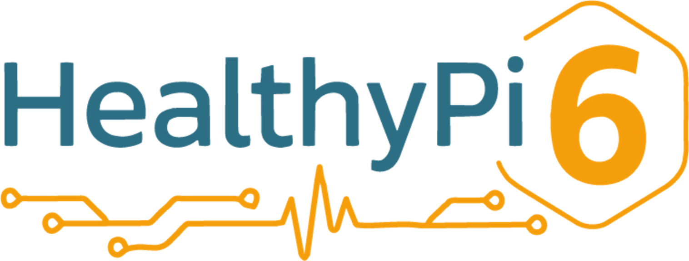
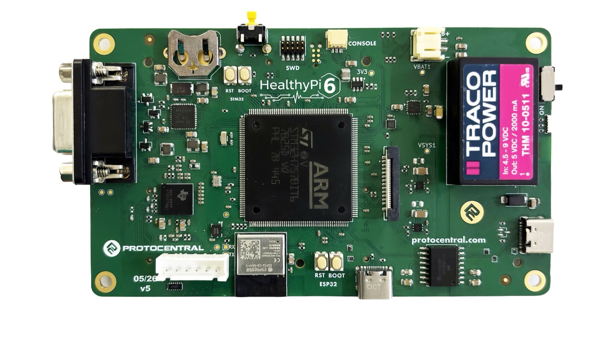
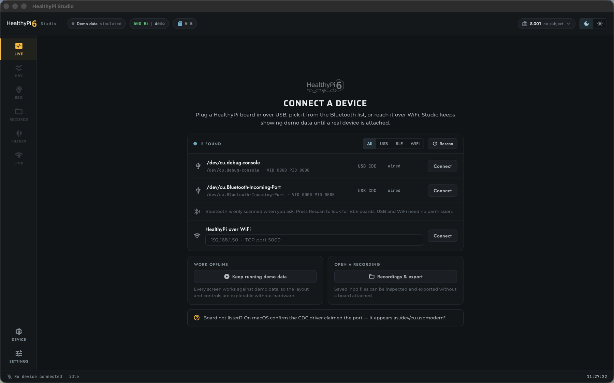
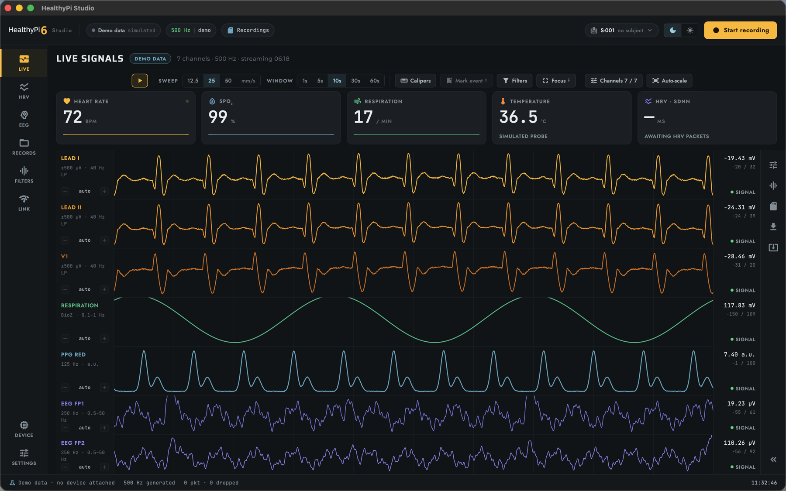
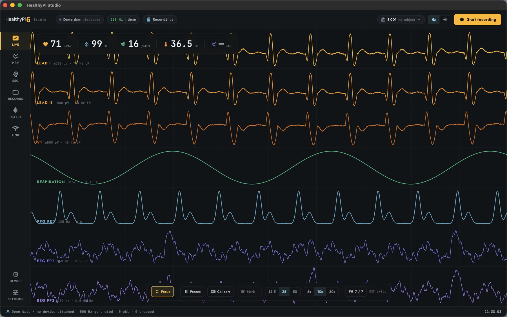
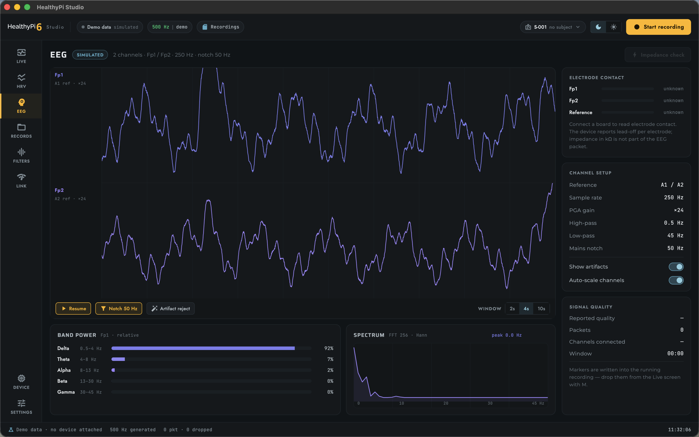
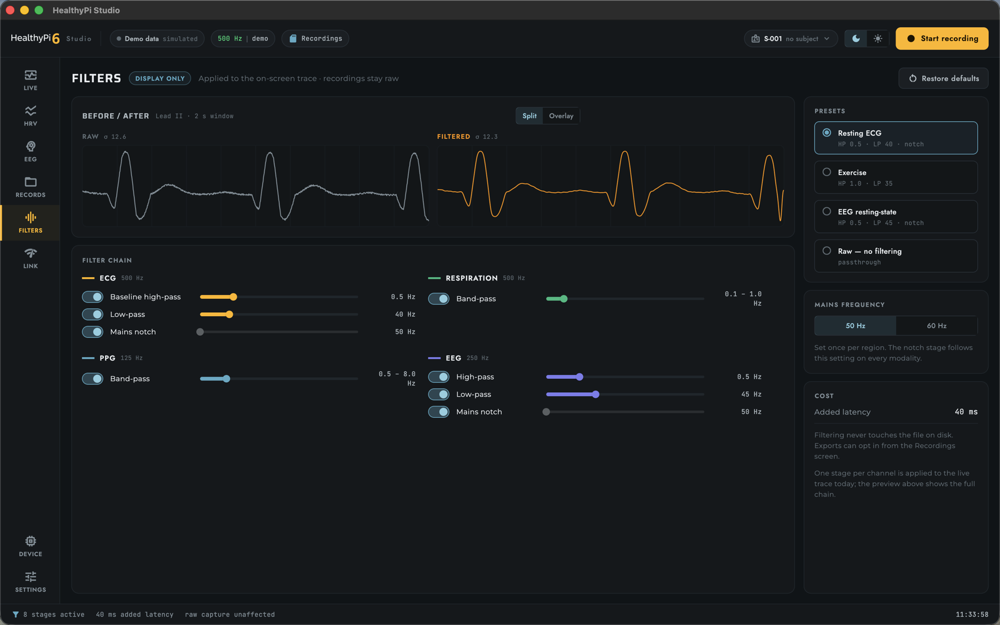
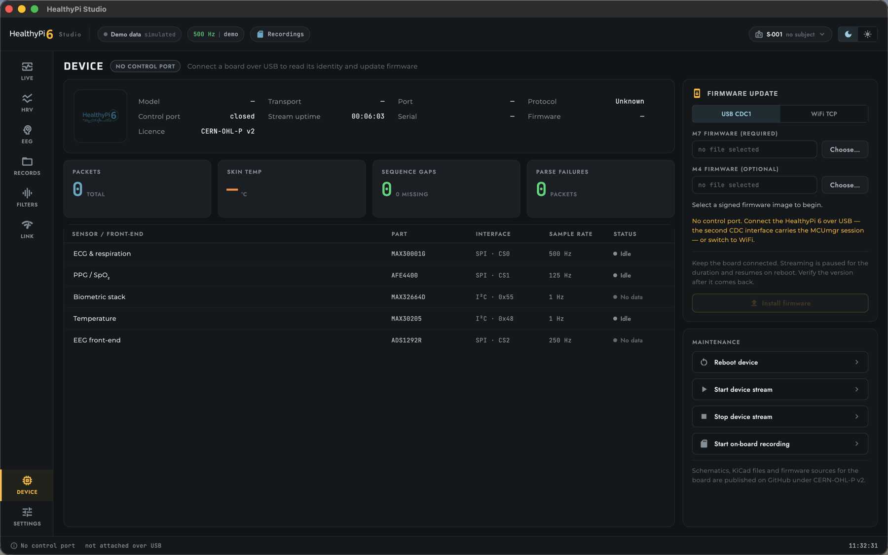

<picture>
  <source media="(prefers-color-scheme: dark)" srcset="docs/images/hpi6-logo-on-dark.png">
  
</picture>

# HealthyPi Studio — Desktop Application



[](https://github.com/Protocentral/healthypi_studio/actions/workflows/ci.yml)
[](https://github.com/Protocentral/healthypi_studio/actions/workflows/release.yml)
[](LICENSE)
[](https://flutter.dev)
[](#get-started)

**The desktop workstation for HealthyPi 6.**

Stream **ECG, respiration, PPG/SpO₂, temperature and EEG** over USB or Wi-Fi, plot
every channel live, record it to `.hpd`, export it to CSV, and update the board's
firmware over MCUmgr SMP. One Flutter codebase, built for macOS, Windows and Linux.
With no board attached, every screen runs against a built-in signal generator.

> **Compatible with HealthyPi 6 only.** Studio speaks the `.HP6` DBLK stream and the
> group-64 MCUmgr surface, which no other board produces, and the two move together —
> mismatched firmware is not a graceful degradation. For HealthyPi 5 or Move, use
> [OpenView 3](https://github.com/Protocentral/protocentral_openview) or the
> [Move app](https://protocentral.com/product/healthypi-move/).

> **HealthyPi 6 is a research and education instrument, not a medical device.**
> Please read [Important notice](#important-notice) before connecting it to a person.

[**Download the latest release**](https://github.com/Protocentral/healthypi_studio/releases)

---

## Get started

Desktop only, and HealthyPi 6 only. **macOS** 10.15+ (Intel and Apple Silicon,
sandboxed), **Windows** 10+ x64, and **Linux** x64/arm64 on GTK 3. There is no
mobile or web build — a browser cannot open a serial port or a raw TCP socket.

Download the archive for your platform from the
[Releases](https://github.com/Protocentral/healthypi_studio/releases) page —
`macos-universal`, `windows-x64`, `linux-x64` or `linux-arm64` — extract it, and run
the app. Verify it against `SHA256SUMS.txt` if you like.

The macOS build is ad-hoc signed and **not notarized**, so the first launch is
blocked; right-click and choose **Open**, or clear the quarantine flag. On Linux,
join the `dialout` group so the app can open the board's serial ports:

```sh
xattr -dr com.apple.quarantine healthypi_studio.app   # macOS
sudo usermod -aG dialout "$USER"                      # Linux — log out and back in
```

Plug in USB and connect: the board enumerates two serial ports and starts streaming.

---

## Connecting

Two transports, either of which carries live data, control and firmware update.

| Transport | Link |
|---|---|
| **USB** | Composite dual-CDC at 921600 baud. **CDC 0** streams samples; **CDC 1** carries the MCUmgr SMP control and firmware session |
| **Wi-Fi** | TCP to the on-board ESP32-C6 — port **5000** for the sample stream, port **9000** for SMP |



*Connect — discovered USB ports and a Wi-Fi host field in one list, with demo data
and opening a recording as the alternatives.*

---

## Screens

Nine screens share one chrome — a device bar, a labelled rail and a status line.



*Live signals — seven channels at 500 Hz on a hand-written canvas painter, with the
vitals strip, sweep/window controls and per-channel gain. `F` for Focus mode.*





*EEG — two channels at 250 Hz, band power and an FFT spectrum. Electrode contact is
reported as the device reports it (lead-off per electrode), not as an invented one.*



*Filters — a chain per modality, a before/after preview, and the added latency it
costs. Display-only; the recording on disk stays raw.*



*Device — identity, health counters, and firmware update. The firmware does not
report a front-end inventory yet, so that card is an empty state rather than a
list Studio made up.*

The window opens at 1600 × 1000, stays usable down to 1200 × 800, and has a light
theme built from the same tokens. `Space` freeze · `R` record · `M` marker ·
`F` focus · `1`–`8` jump to a screen · `Esc` exit focus or close the inspector dock.

---

## Build from source

Requires Flutter **3.44** (stable) or newer, Dart SDK `^3.10.0`, plus Xcode 15+ on
macOS, Visual Studio 2022 with *Desktop development with C++* on Windows, or
`clang cmake ninja-build pkg-config libgtk-3-dev libudev-dev` on Linux.

```bash
git clone https://github.com/Protocentral/healthypi_studio.git
cd healthypi_studio && flutter pub get
flutter run -d macos                 # or: windows / linux
flutter build macos --release        # release build
flutter analyze && flutter test      # development checks
```

`flutter test` is currently **89 passing / 25 failing**; the failures target the
retired OpenView packet parser — dead code superseded by the DBLK path — plus one
recording fixture. They are tracked, and are not regressions.

[`ci.yml`](.github/workflows/ci.yml) runs analyze (blocking) and test (reported) on
every push and PR to `main`; [`release.yml`](.github/workflows/release.yml) builds all
four archives on a `v*` tag and publishes a Release with `SHA256SUMS.txt`, pinning
Flutter **3.44.6** so a rebuild of a tag is reproducible.

---

## Formats

The board streams `.HP6` **DBLK** blocks — a 28-byte little-endian header (`DBLK`
magic, `block_len`, `seq`, `t_ms`, `channel`, `flags`, `sample_count`), sample
structs, and a trailing CRC-32. The parser resynchronizes on a bad magic, length or
CRC, counting each as a dropped packet. Rates: ECG and respiration 500 Hz, PPG
125 Hz, EEG 250 Hz, HRV 1 Hz — roughly 19 KB/s sustained.

Recordings are `.hpd`: block-based and append-only, sharing the DBLK block model with
the live stream and compatible with
[OpenView 3](https://github.com/Protocentral/protocentral_openview). They land in
`HealthyPi_Recordings/` under the platform documents directory — on macOS, inside the
sandbox container — with exports beside them in `HealthyPi_Exports/`. Both formats,
the MCUmgr SMP surface and the USB dual-CDC topology are specified in
[`docs/PROTOCOL_REFERENCE.md`](docs/PROTOCOL_REFERENCE.md).

---

## Updating a device

Studio speaks MCUmgr SMP over USB CDC 1 or Wi-Fi TCP port 9000, and flashes the M7
image — and optionally the M4 image — from the Device screen. The device side of the
update system (MCUboot, the signed bundle, serial recovery) is documented in
[`healthypi-6-fw`](https://github.com/protocentral/healthypi-6-fw).

> ### ⚠️ Firmware update is beta
>
> The staged image is now read back and its hash checked against the file before
> anything is marked for boot, and **Confirm firmware** under Maintenance confirms
> the running image once the board is back — until you do, MCUboot reverts on the
> next reboot. Still missing: per-chunk retry, and a reset timeout is treated as
> success. Keep the board connected for the whole flash, and prefer USB over Wi-Fi.

---

## What's in this repository

```
lib/shell/            app chrome: device bar, rail, status line, navigation
lib/screens/studio/   the nine screens
lib/widgets/hpi/      component kit — cards, tables, meters, wave traces
lib/theme/            colour and type tokens (dark + light)
lib/services/         transports, parser, recording, export, filters, SMP/OTA
lib/controllers/      ChannelController — ring buffers and channel sync
docs/  test/          protocol reference, developer guide, design system; tests
```

Serial is [flutter_libserialport](https://pub.dev/packages/flutter_libserialport),
state [provider](https://pub.dev/packages/provider), FFT
[fftea](https://pub.dev/packages/fftea). Waveform rendering is deliberately not on
that list — it is a hand-written `CustomPainter` over the sample ring buffer.

---

## Software and documentation

| Link | What it is |
|---|---|
| [`healthypi-6-fw`](https://github.com/protocentral/healthypi-6-fw) | HealthyPi 6 firmware — STM32H757, the source of the `.HP6` stream |
| [`healthybridge-esp32`](https://github.com/protocentral/healthybridge-esp32) | ESP32 network co-processor firmware — the radio side |
| [`protocentral_openview`](https://github.com/Protocentral/protocentral_openview) | OpenView 3 — shares the `.hpd` recording format |
| [`docs/PROTOCOL_REFERENCE.md`](docs/PROTOCOL_REFERENCE.md) | **wire formats** — DBLK stream, MCUmgr SMP and OTA, USB dual-CDC, the `.hpd` file |
| [`docs/DEVELOPER_GUIDE.md`](docs/DEVELOPER_GUIDE.md) | architecture, parsing, waveforms, filters, export, debugging checklist (§ 3) |
| [`docs/DESIGN_SYSTEM.md`](docs/DESIGN_SYSTEM.md) | **UI tokens, chrome and the component kit** — and the rules about not overstating device data |
| [`docs/README.md`](docs/README.md) · [`CHANGELOG.md`](CHANGELOG.md) | documentation index; release history |

---

## Status

The honest state, so you can judge what to rely on.

**Working and hardware-validated** — USB dual-CDC streaming at 921600 baud; Wi-Fi
streaming over TCP 5000; the seven-channel live canvas; recording to `.hpd` with
pre-buffer, markers and session metadata; CSV export of the raw recorded
signal; the filter chains; and the link-health diagnostics.

**Not finished:**

| Area | Status | Notes |
|---|---|---|
| **Firmware update** | Beta | See [Updating a device](#updating-a-device) |
| **HRV analysis** | Experimental | Metrics come from the device's HRV packet; the firmware reports `pNN50` and mean R-R as zero, so Studio shows them as *not reported*. The demo generator emits no HRV, so this screen stays empty without a board |
| **EEG** | Experimental | The screen is complete and Studio decodes the `.HP6` EEG channel (DBLK channel 5), but **no shipping firmware sends it**, so the screen runs on simulated data and is labelled *simulated* in the UI. Two things gate it, both firmware-side: `hpi_stream_enable()` rejects any `stream_start` carrying the EEG bit with `-ENOTSUP`, and `mod_eeg.c` compiles its ADS1299 acquisition path out unless `CONFIG_SENSOR_ADS1299` is set, which no app config sets. The decode is untested against hardware |
| **Boards other than HealthyPi 6** | Not supported | No plans to support HealthyPi 5 or Move here |

Studio never invents a value. A metric the device has not reported renders as an em
dash, and an unimplemented control says so in place rather than being hidden — the
current list is in [`docs/DESIGN_SYSTEM.md`](docs/DESIGN_SYSTEM.md) § 8.

---

## Support

Open an issue in the repository that matches the problem: the application, its
screens, parsing, recording or export → this repository; acquisition or the `.HP6`
stream → [`healthypi-6-fw`](https://github.com/protocentral/healthypi-6-fw); Wi-Fi
or MQTT →
[`healthybridge-esp32`](https://github.com/protocentral/healthybridge-esp32).
Include your platform, app version, transport, and the board's firmware versions.

One thing catches most people out: firmware update needs the **second** CDC
interface, so connect over USB, or switch the panel to Wi-Fi TCP. A
*Demo data* badge means no transport is attached. Debugging checklist:
[`docs/DEVELOPER_GUIDE.md`](docs/DEVELOPER_GUIDE.md) § 3.

---

## Contributing

Issues and pull requests are welcome at
[Protocentral/healthypi_studio](https://github.com/Protocentral/healthypi_studio/issues).
Read [`docs/DESIGN_SYSTEM.md`](docs/DESIGN_SYSTEM.md) before changing any UI file,
keep `flutter analyze` at zero errors and zero warnings, and never render a value
the device did not report.

---

## Important notice

**HealthyPi 6 is not a medical device.** It is intended for education, research and
development only — not certified, calibrated or validated for diagnosis, treatment or
any clinical decision. Nothing this application displays, records or exports may be
relied on for a medical decision.

**Do not connect a person to a device powered from a mains-derived USB supply.** Use
battery power, or a properly isolated supply, whenever electrodes are attached to a body.

---

## License

MIT License — Copyright © 2025 ProtoCentral Electronics. Full terms in
[`LICENSE`](LICENSE). Third-party Flutter and Dart packages remain under their own
licences; documentation is CC BY-SA 4.0. Distributed in the hope that it will be
useful, but **without any warranty**.

---

Part of the HealthyPi family, alongside
[HealthyPi 5](https://github.com/Protocentral/protocentral_healthypi_5) (RP2040, Pi
HAT) and [HealthyPi Move](https://github.com/Protocentral/healthypi-move-fw)
(wrist-worn, nRF5340) — neither of which this application supports.

Designed and built by **[ProtoCentral Electronics](https://protocentral.com)**.
